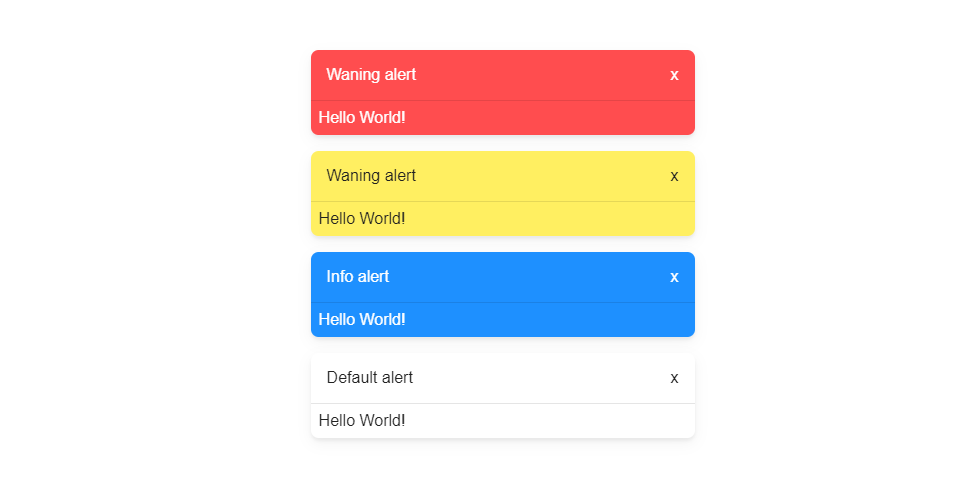

# Custom Alerts
#### A very simple and lightweight alerts system created with vanilla JavaScript.



### Features
* Created with Vanilla JS 🌈
* ⚡ Lightweight: `1.84KB` ( `0.66KB` GZIP ), CSS: `1.25KB` ( `0.54KB` GZIP )
* Multiple options to configure
* Effects FadeIn / FadeOut with CSS
___

#### Usage
```html
<link rel="stylesheet" href="src/customAlerts.min.css">
<script src="src/customAlerts.min.js"></script>
```

Inicialitate the **CustomAlerts** class
```js
let alerts = new CustomAlerts({
	delay: 100,
	autoclose: 5000
});
```
`The values in the top example are the default, you can customize it setting it in milliseconds`

After initialize class, you can call the `alerts` variable to create new alerts, like:
```js
alerts.alert({
	type: 'info',
	title: 'Hello Github!',
	content: '<code>I\'m the code 😎</code>',
	delay: 2000,
	autoclose: 0
})
```
`If you don't set the delay and/or auto close, the alert get the values of the class initialization or default values if you didn't specify them`

&nbsp;

#### Explaining the options

| Name | Type | Description |
|---|---|---|
| `type` | class name | You can create all you want classes in css to set the colors or design in general |
| `id` | text | The name of the **Id** attribute in the alert |
| `title` | text | The title of the alert |
| `content` | text / html | The content of the alert |
| `delay` | number in ms | The time to wait to see the alert |
| `autoclose` | number in ms | The time to auto close the alert |